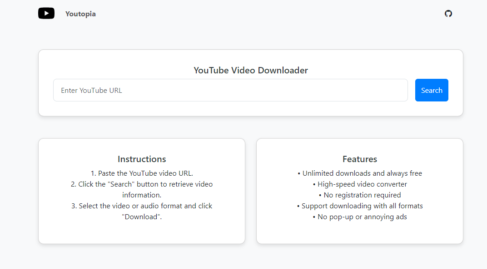

# Youtopia - YouTube Video Downloader

Youtopia is a simple and efficient YouTube video downloader built using Node.js, Express, and EJS. It allows users to download YouTube videos in various formats and qualities directly from their browser.



## Features

- Download videos in multiple qualities (360p, 720p, etc.)
- Option to download audio-only files
- Responsive design for all screen sizes
- No pop-ups or annoying ads

## Installation

1. Clone the repository:
    ```bash
    git clone https://github.com/Talha6891/youtopia.git
    cd youtopia
    ```

2. Install the dependencies:
    ```bash
    npm install
    ```

## Usage

To start the application, run:

```bash
npm start
```
Then, open your browser and navigate to:
```bash
http://localhost:3000
```
